# API testing 
## Presentation of my API testing project (CRUD on free API with Tests) in Postman

- **API:** RESTFUL-API [https://restful-api.dev](https://restful-api.dev/)
- **Allowed Methods:** `GET`, `POST`, `PUT`, `PATCH`, `DELETE`, `OPTIONS`, `HEAD`
- **Accepted Objects:** predefined objets `"name"`, `"data"` with free values
- **Base URL:** `https://api.restful-api.dev/`
- **Endpoint:** `/objects`

## Collection Overview and Setting Up Variables

- Postman collection contains CRUD requests grouped in a single folder.
- Variables are created at the collection level to store request (and response) data.

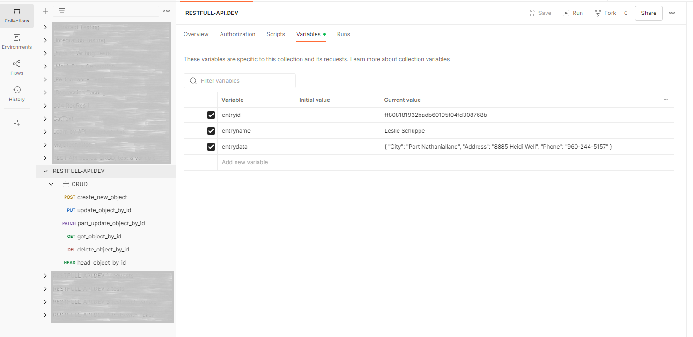


---

## Creating a New Record (POST Request)

- Record data is prepared with random values (`name`, `city`, `address`, `phone`) in **Pre-request Scripts**.

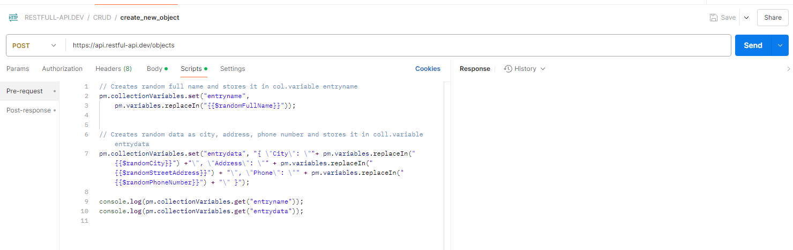
 
- Sends a `POST` request with JSON data.
 
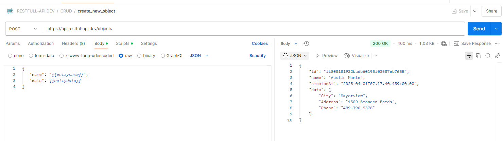

- Stores the record `id` from the response in a collection variable.
- Tests response for HTTP status code, header `content-type`, matching `name` & `data`, response time

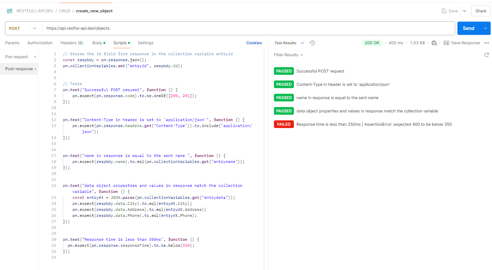

---

## Updating a Record (PUT Request)

- Modifies the record with a new `address`.
- Stores updated data in a collection variable.

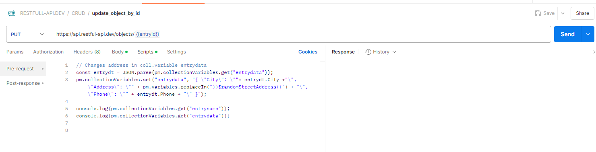


- Sends `PUT` request with JSON data.

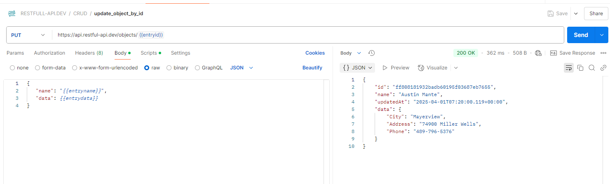

- Tests response (HTTP status code, header `content-type`, matching `name` & `data`, response time).

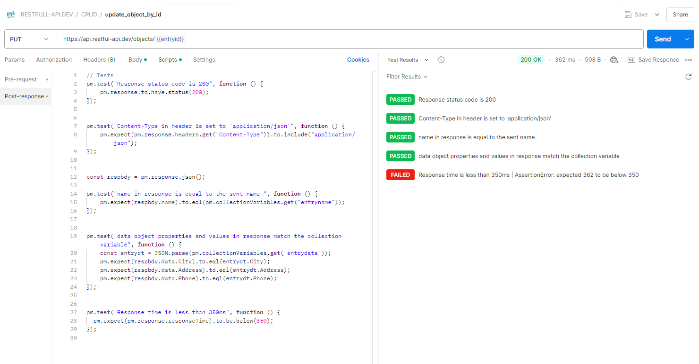

---

## Partial Update (PATCH Request)

- Changes `phone` number and stores updated data in a collection variable.


- Updates only the `data` object.

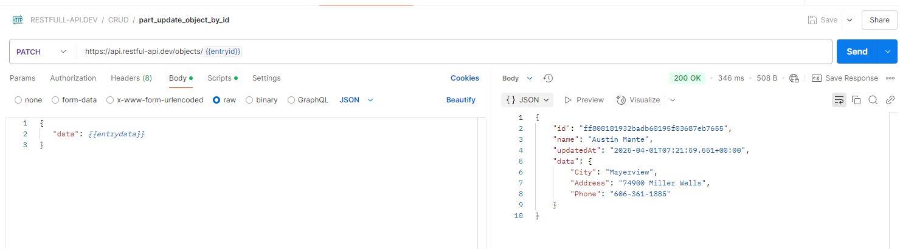

- Tests response (HTTP status code, header `content-type`, matching `data`, response time).

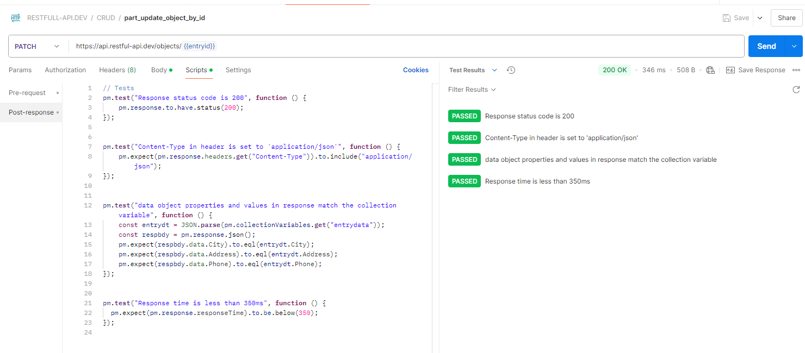

---

## Retrieving the Record (GET Request)

- Fetches the record to verify updates.

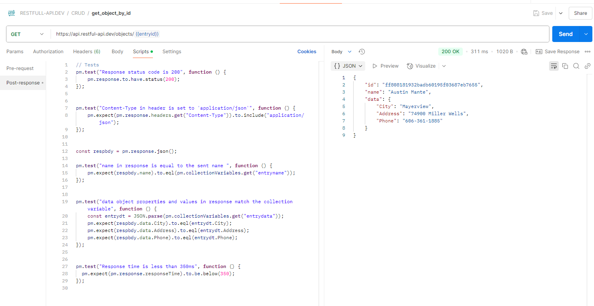

- Tests response (HTTP status code, header `content-type`, matching `name` & `data`, response time).

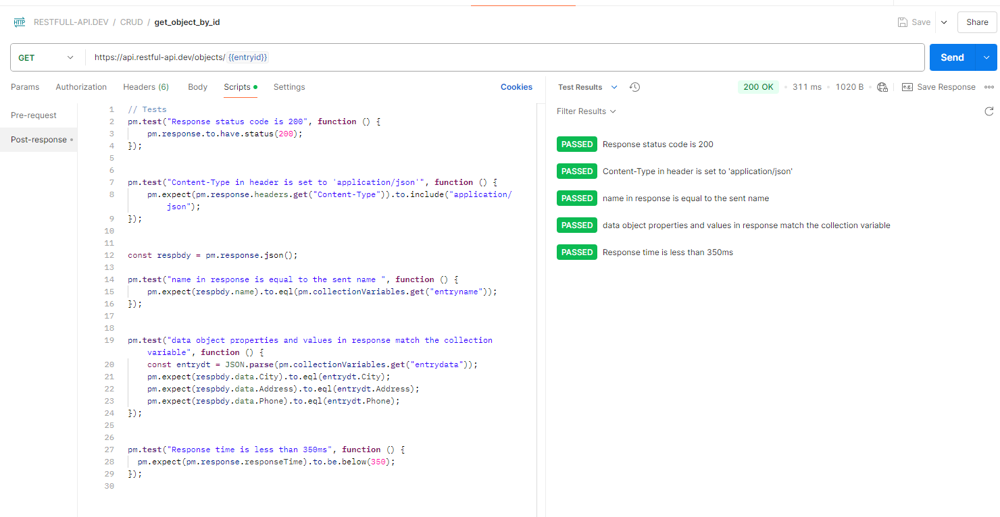

---

## Deleting a Record (DELETE Request)

- Deletes the created record.

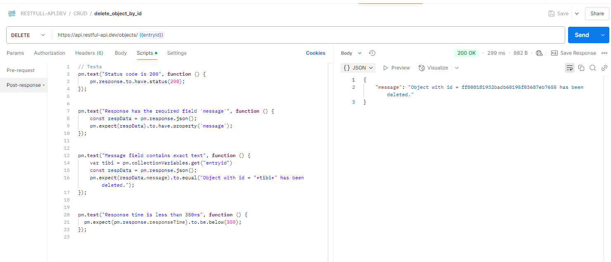

- Tests response for HTTP status code, expected message, response time

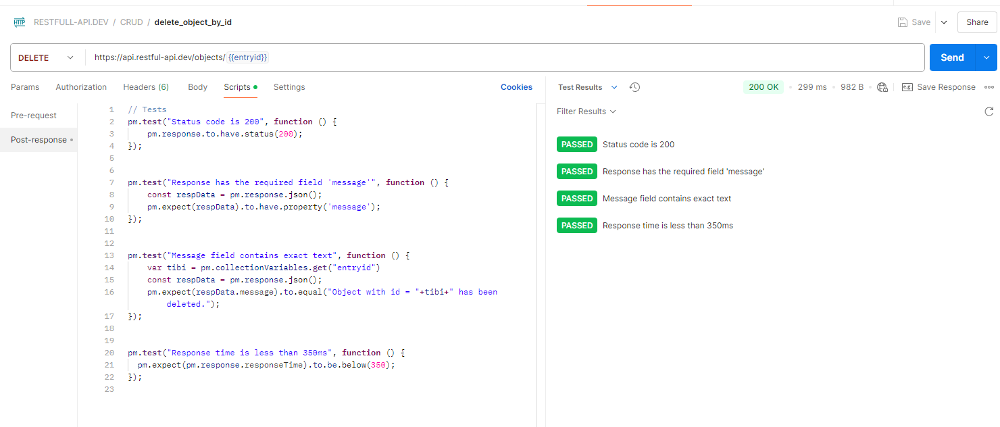

---

## Verifying Deletion (HEAD Request)

- Ensures the record no longer exists using a `HEAD` request.

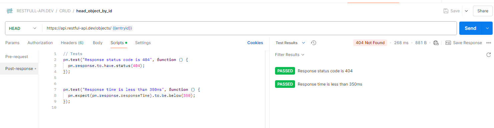

---

## Console log

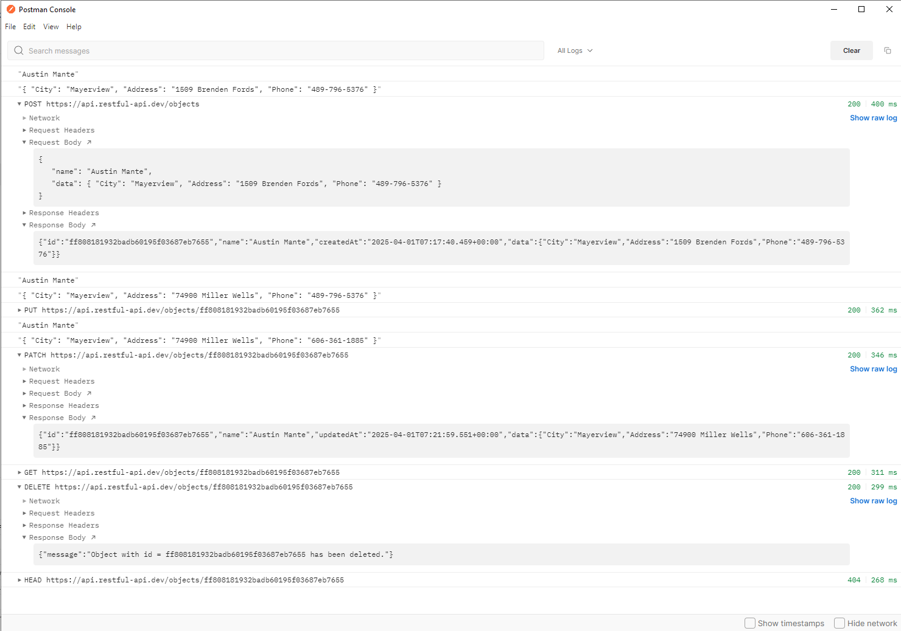

## Running the Full Collection in Postman Runner

- Executes the entire test collection to validate CRUD operations.

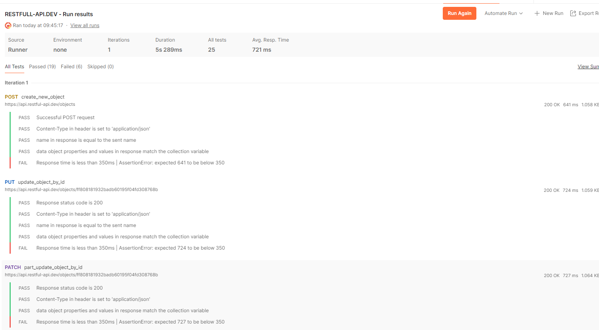
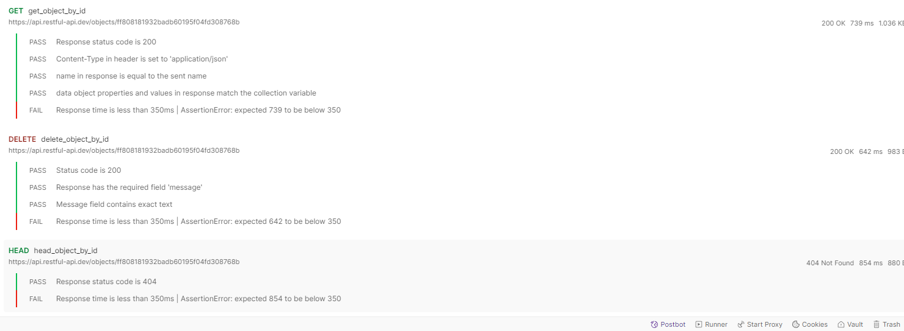

---

## 📂 Project Structure
```plaintext
/
├── RESTFULL-API.DEV.postman_collection.json  # Exported Postman collection
├── README.md                                 # Project documentation (this file)
├── screenshots/                              # Folder containing all screenshots
├── docs/                                     # Folder containing project documentation in pdf 
│   ├── Project_Postman.pdf
```

---

## How to Use This Project
1. **Import the Collection**: Open Postman and import `RESTFULL-API.DEV.postman_collection.json`.
2. **Run the Tests**: Execute the collection to validate CRUD operations.
3. **Check the Results**: Review test results and API responses.

---

🚀 Happy Testing! 🎯
